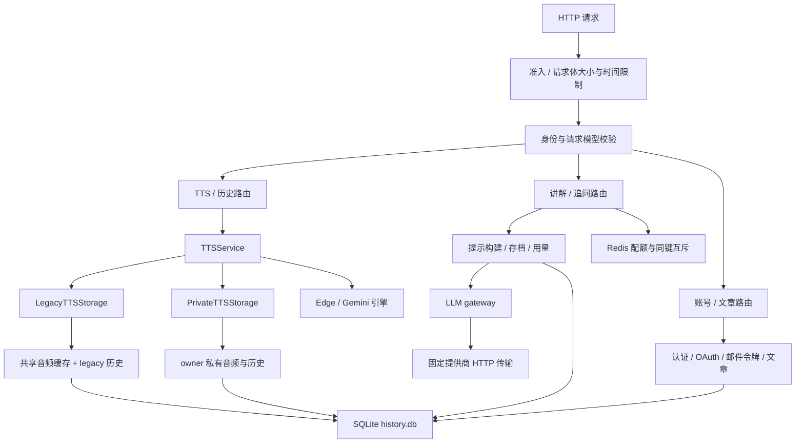

# 后端复杂度、冗余与简化机会审查报告

审查日期：2026-10-04。基准：`b28699f85639ece8a8606bac044d9abbd4a3272f` 上的**当前未提交工作区**，不是该提交的原始代码。此前已有的源码修改和文档删除均保留；本次只更新报告，没有实施后端重构。

范围：`src/app/` 全部 **55 个 Python 文件、5263 行**，包含包入口、配置、管理命令、所有 API、请求/响应模型、认证、文章、迁移、TTS、缓存、历史、LLM、配额和运行时控制。另核对相关测试、前端调用、运维脚本、依赖声明、Dockerfile、Compose 和 `.env.example`。行数包含空行和注释，不能直接衡量设计质量。

目标：指出哪些代码在当前功能契约下可以简化，以及哪些复杂度来自真实要求。本报告不授权删除数据、改变认证协议或实施重构。

额外审查摘要的核验结果另行归档：[成立的发现](backend_confirmed_findings.md)和[部分成立的判断](backend_partially_confirmed_findings.md)。两份记录分别保留具体事实及设计推论的适用边界。

## 1. 主要结论

没有证据支持“后端大部分模块无用”或“一并删除安全、迁移和缓存抽象”。`TTSService` 已把两种存储模式的共同流程集中起来；`runtime.py` 已用 `_deadline`、`_upstream_slot` 共用并发实现。多个旧问题在当前工作区中已不存在。

最值得处理的是三个层次：

1. **重复表达或重复工作**：LLM 已解析的模型信息仍经四元组往返；普通身份 helper 保留失效的 Header 注入声明；私有淘汰循环重复聚合用量；部分索引不匹配实际排序；开发 JWT 密钥只读查询申请写锁。
2. **有复杂保护，却缺少完整生命周期**：讲解有容量预留，但保存不验证预留归属和有效期；追问账本和消息分两次提交；讲解存档没有应用内删除入口；文章墓碑有正确乱序保护，却没有回收政策。
3. **取决于契约的性能与架构取舍**：历史全量扫描、清单读取音频、私有内存缓存、全局存储锁、双存储模式、Redis 和 JWT。不能仅凭“看起来复杂”直接删除。

优先补齐存储预留与追问保存协议，再处理数据生命周期。没有真实负载或吞吐量测量，本报告不把额外 I/O 自动等同于严重性能瓶颈，也不宣称任何重构零风险。

### 判断标准

- **确认**：调用链、查询、测试或隔离探针证明重复/额外工作。确认成本不等于可以无条件删除。
- **条件性**：简化需要改变兼容、错误响应、检测时机、部署或保留契约。
- **应保留**：有明确用途，删除会丢失能力或保护。
- **P1**：先完善正确性或持续使用所需的数据生命周期。
- **P2**：可规划实施的结构/查询简化。
- **P3**：收益小或需要测量、产品决定，避免增加更大的框架。

| 编号 | 发现 | 判断 | 优先级 |
|---|---|---|---|
| F01 | LLM selection、ID 参数与返回四元组重复表达选择 | 确认 | P2 |
| F02 | 普通身份 helper 的 Header 声明和异步包装无实际作用 | 确认 | P3 |
| F03 | 邮件可用性判断重复实现 | 确认 | P3 |
| F04 | 引擎集合双源维护、固定 PCM 位宽假参数 | 确认 | P3 |
| F05 | 共享认证依赖和用户管理跨层分散 | 确认结构成本 | P2 |
| F06 | 开发 JWT 密钥只读查询申请 SQLite 写锁 | 确认 | P2 |
| F07 | 同库三套初始化生命周期 | 确认；合并需迁移验证 | P2 |
| F08 | 预留 token 未校验；正常保存还执行未使用的容量查询 | 已复现；不是已证实 HTTP 漏洞 | P1 |
| F09 | 追问账本和消息分开提交，失败恢复缺口 | 已复现 | P1 |
| F10 | 讲解存档容量保护缺少应用内释放路径 | 确认；清理策略需决定 | P1 |
| F11 | 永久墓碑缺少回收政策；404 分支重复 UPDATE | 确认；墓碑本身应保留 | P2 |
| F12 | 文章摘要列表读回全部正文、没有分页 | 确认 | P2 |
| F13 | legacy 历史日期兼容成本落在每次查询 | 确认；先迁移才可简化 | P2 |
| F14 | 私有历史先检查全部 ready 文件，再返回少量记录 | 已复现；改变范围有条件 | P2 |
| F15 | 时间轴清单接口读取完整音频 | 已复现；拆分有条件 | P2 |
| F16 | 私有历史时间索引与实际排序不匹配 | 已核验计划；删除需升级验证 | P2 |
| F17 | 私有淘汰循环每个 victim 重做 SUM/COUNT | 确认 | P2 |
| F18 | 私有内存层不避免全量磁盘校验，收益有限 | 条件性，需测量 | P3 |
| F19 | 全局存储锁覆盖较大的 I/O 与事务范围 | 确认范围；缩锁需并发证据 | P3 |
| F20 | legacy 扫目录和双模式的长期维护成本 | 条件性，需明确退出门槛 | P3 |
| F21 | 核心服务生产配置和 readiness 强依赖 Copilot | 行为确认；拆分取决于定位 | P2 |
| F22 | JWT 加必查数据库会话可能有简化空间 | 条件性协议变更 | P3 |

## 2. 实际结构与职责



| 控制机制 | 保护对象 | 判断 |
|---|---|---|
| RequestLimits | 请求数量、活跃请求、请求体、慢速上传 | 业务前资源控制，不能用提供商 semaphore 替代 |
| 认证 SQLite 限流 | 登录、恢复等账号操作 | 阈值更严，与免费 TTS/付费 LLM 目标不同 |
| cache_lock | 同 loop 内同生成键/同会话 | 防重复生成与读改写竞争 |
| Redis 同键锁 | 跨进程同讲解/会话 | 单 worker 有简化空间，不是上游并发限制 |
| 提供商 semaphore | 不同键对同提供商的并发 | 与同键锁不能互相替代 |
| SQLite 预留 | 付费生成前预留总存储容量 | 应完善消费协议，不能直接撤掉 |
| Redis 加权额度 | 用户分钟/日、全局日额度 | 与存储容量不同 |
| 本地用量账本 | 成功调用和 token 汇总 | 不是第二份配额锁 |
| SQLite 事务/线程锁 | 跨线程、容量、文件一致性 | 不能由 asyncio 键锁一概替代 |

Redis 额度是按分钟/UTC 日分桶的固定窗口，代码不是滑动窗口。准入计数与成功账本不承诺所有失败时都相等；失败请求可能已消耗上游资源。

## 3. 可以小范围收敛的重复代码

### F01：LLM 选择信息重复传递和返回

**证据**：[api/explain.py](../src/app/api/explain.py#L65) 的 65–69、92–94、163–188 行已解析 profile/mode，却同时传 `model_id/mode_id` 和 selection。[explain_service.py](../src/app/services/explain_service.py#L217) 的 217–236 行在 selection 存在时忽略 ID。[gateway.py](../src/app/services/llm/gateway.py#L5) 的 5–9 行再把 profile.id、mode.id、revision 包回四元组，交给路由拆包。

**成本**：不是重复网络调用，而是重复表达已知数据。变更返回契约需要理解路由、生成 helper、gateway 与四元组 mock。gateway 被实际调用，是薄包装，不是死模块。

**最小建议**：生产生成入口统一接收已验证的 profile/mode，返回 LLMResult；持久化元数据从相同选择读取。仍需统一生成接缝时保留 gateway，无独立职责时再合并。不能删缓存键的模型/模式/版本维度或 provider 边界。

**验证与风险**：`test_explain_success_miss`、`test_chat_uses_stored_model`、`test_generate_calls_gateway_with_structured_messages` 和 release 模拟函数依赖现有签名。需同步调整并保留缓存/追问模式语义。置信度高，风险低到中。

### F02：普通身份 helper 的依赖声明已失效

**证据**：[dependencies.py](../src/app/api/dependencies.py#L12) 的 require_client_id 没有异步 I/O。应用只有 `_resolve_identity()` 普通 await 调用，没有 Depends(require_client_id)。实际 Header 注入在 require_tts_identity / require_copilot_identity。

**成本与建议**：普通调用不会执行 Annotated Header 的注入，保留这种外观会误导。改成接收 `str | None` 的同步内部 helper，去掉 await 和无作用 Header 声明；保留 normalize_client_id 和 account_ 保留前缀拒绝。

**验证与风险**：`test_identity_dependencies.py` 浏览器输入用例、`test_reserved_account_identity_cannot_be_spoofed_anonymously`。置信度高、风险低；没有可观性能收益的证据。

### F03：邮件可用性判断有两份

**证据**：[auth.py](../src/app/api/auth.py#L46) 配置接口使用 bool(SMTP_HOST and SMTP_FROM)；[mail_service.py](../src/app/services/mail_service.py#L13) 已有相同 mail_enabled，注册与 require_mail 也使用它。

**最小建议**：配置接口调用现有 helper，避免以后 UI 能力声明与服务准入不一致。不新增抽象。当前行为一致，不是已发生缺陷。

**验证与风险**：`tests/test_auth_email.py`。置信度高、风险低。

### F04：两个很小的接口维护冗余

**引擎双源**：[schemas/tts.py](../src/app/schemas/tts.py#L31) 的 edge/gemini 元组和 [engines/__init__.py](../src/app/services/engines/__init__.py#L6) 的注册表都定义允许集合。可让 field validator 规范化后通过 get_engine 验证，保留未知引擎 422、音色检查和直接引擎调用保护。当前没有错误。

**固定 PCM 参数**：[gemini_engine.py](../src/app/services/engines/gemini_engine.py#L62) 的 sample_width 默认 2，其他值都报错，ffmpeg 固定 s16le。生产/测试没有传该参数。可删内部参数及 guard，保持 16 位 PCM、采样率/声道校验、大小限制和子进程清理。

**验证与风险**：引擎/音色边界、真实 SDK 模拟转码、转码超时和大小测试。置信度高，只值得顺手整理，不值得另造可配置转码框架。

### F05：共享认证依赖和用户管理跨层分散

**证据**：`api/users.py:4` 从 auth 路由导入 admin_account/guard/queue_email；`api/articles.py:5` 从 auth 路由导入 current_account；`auth_service.py:93` 反向导入 API 私有 IP helper。注册在 user_service，用户列表及权限/状态更新在 auth_service 的 199–223 行。

**成本与建议**：用户规则跨服务、共享依赖挂在具体路由、服务依赖 API 私有函数，增加导航与修改成本；未发现因此产生的循环导入或失败。可把认证依赖放入已有 dependencies、用户管理归入用户服务、IP 从 API 传入或成为共享普通函数。不为整理新增事件/认证框架。

**保留与验证**：入口 admin_account 不能替代事务内管理员复检，两者保护不同时间点。运行 auth/auth_security 与可信代理解析用例。置信度高，结构调整风险中等。

## 4. 数据库、生命周期与协议复杂度

### F06：开发 JWT 密钥只读路径也申请写锁

**证据**：[auth_service.py](../src/app/services/auth_service.py#L45) 的 signing_key 在没有显式 secret、且不属于 production 时，每次使用 account_connection(write=True)。create_session 和每次 authenticate 都调用它。[database.py](../src/app/services/database.py#L59) 的 69–71 行对 write 执行 BEGIN IMMEDIATE。密钥存在时实际上只有 SELECT。

**成本**：稳定持久化密钥有必要，但已存在密钥的查找无需先争夺写锁，会与文章保存、会话撤销等同库写入竞争。影响范围是没有配置显式密钥的 development/test，不能称为生产认证瓶颈。

**最小建议**：先只读查询；缺失时进入写事务并再次查询，再生成。避免直接增加不区分 DB_PATH 的全局缓存，测试会更换数据库路径。

**验证与风险**：签名、撤销及重启持久化保护必须保留；当前测试未直接断言已存在密钥读取不持有写锁，可补读锁竞争用例。置信度高，风险低到中。

### F07：同一个数据库有三套初始化生命周期

**证据**：[database.py](../src/app/services/database.py#L38) 统一迁移 users/articles/history；[explain_service.py](../src/app/services/explain_service.py#L22) 的 22–100 行维护第二套 initialized/lock，在访问连接时建表、补列并提交；[private_tts_storage.py](../src/app/services/private_tts_storage.py#L69) 的 69–104 行也维护 store 初始化。main.lifespan 初始化基础库和当前 TTS 存储，没有初始化讲解表。

**成本与边界**：维护者需记住三种时机、状态和事务边界。讲解首次访问承担迁移和失败，fixture 要分别复位基础库与讲解状态。私有 store 可用独立路径，这部分独立初始化有实际用途。

**最小建议**：先提取 migrate_explanations(conn)，在主库启动事务中执行，让连接 helper 只管连接。私有 TTS 也可提取纯迁移函数，但保留独立 store 初始化入口，不把所有 path 强制绑定主库，也不把全部 SQL 塞入巨大文件。

**验证与风险**：构造缺列旧讲解表，验证数据保留、失败回滚、再次启动及重复初始化。当前 roundtrip 不等于旧表迁移覆盖。置信度高，迁移时机变更风险中到高。

**时间约定**：timestamps 已统一账号/新播放写入；讲解仍写本地 naive 时间，用量日是 UTC 日期，认证到期是 epoch 秒。这些不是全部互不兼容的错误格式：日桶/到期秒有独立用途。建议统一绝对事件时间，不把所有字段强行换成字符串。

### F08：存储预留协议未完成有效消费校验

**证据**：[explain_service.py](../src/app/services/explain_service.py#L263) 的 263–298 行存储 token/client_id/explain_key/expires_at；保存的 334–360 行只凭 reservation_token 为真绕过上限，再按 token 删除，未检查存在、归属、对应键、有效期或是否已消费。

**隔离复现**：容量设为 1；Alice 创建已过期预留；Bob 申请时清理它并保存一条；Alice 使用旧 token 保存第二条。结果 **capacity=1、records=2**。只使用临时 SQLite，没有提供商调用。

**判断边界**：请求 schema 未定义 reservation_token，路由不读取或转发客户端提交的该字段；保存所用 token 由路由内部产生，并有总 deadline 和额外 TTL 余量。复现证明内部协议缺少不变量保护，不证明普通 HTTP 客户端可利用；正常快速路径通常不会遇到此状态。

**最小建议**：在保存的同一 BEGIN IMMEDIATE 事务内验证并消费与 owner/key 匹配且存活的预留；无效预留应拒绝，或按明确策略重新检查容量。先补齐协议再优化 SQL。

**实际冗余**：保存无条件执行 exists/count 两条查询，但有非空 token 时结果不参与判断。有效预留协议完成后，可以把它们限制在无预留分支；不能继续把任意字符串当容量凭证。预留关联字段应该真正使用，不能机械视为死字段删除。

**验证与风险**：保留满库、争抢、过期清理和账本失败回滚；新增过期后保存、错 owner/key、重复消费、不同键争抢最后一格。置信度高，协议修订需谨慎。

### F09：追问账本与消息分开提交，恢复协议不完整

**证据**：`api/explain.py:189–196` 先 record_usage，再 append_chat_messages，两者分别开连接/事务。首次讲解的保存与成功账本却在 save_explanation 的同一事务。

**隔离复现**：先成功提交一次 record_usage，用 SQLite trigger 让 messages UPDATE 失败。结果 **ledger_calls=1、stored_messages=0**。账本可以准确记录已完成的上游调用，但答案未保存，重试去重无法识别这次完成的生成。

**成本与判断**：最后一对消息去重只保护已保存答案的重试，不能保护上游完成后消息落库失败。再次请求可能重新调用和计费。现有截断回答测试针对上游未完成，不覆盖这个持久化阶段。

**最小建议**：若账本统计已持久化成功轮次，消息追加和该轮账本可收敛成一个保存函数/事务。若必须记录全部实际付费完成调用，则保留账本，并设计可复用已生成答案的完成状态或请求标识。后者更复杂，先明确账本定义。单纯合并事务不能消除所有上游成功、数据库失败后的重复计费。

**验证与风险**：注入消息失败、账本失败、返回前断连；重试时核验 provider 调用次数、答案及账本。置信度高，不能以现有重试去重测试宣称此问题已覆盖。

### F10：讲解容量保护缺少应用内释放路径

**证据**：EXPLANATION_MAX_RECORDS 默认 **1000**，是全库可配置上限；reserve_storage_slot 在付费调用前阻止新增。全仓后端/脚本没有 DELETE FROM explanations 或讲解删除/清空 API。`.env.example:104–109` 明确承诺到上限不自动删除，需管理员释放或提高容量。

**实际行为**：`test_explain_full_database_zero_paid_calls` 证明新键返回 **507**、没有上游付费调用；已有缓存仍 **200**。已有追问不走新增讲解预留，但仍可能受数据库字节总量、Redis 额度等限制。所以不是满 1000 后全系统永久 503。

**成本**：容量保护是有意设计，问题在于没有释放工具。长期使用会停在只能手工处理的状态。context_id 隔离还意味着不同消息中的同一句可能占不同存档，1000 不等于 1000 句独特文本。

**最小建议**：优先提供 owner 范围内删除/清空或可审查的管理员清理入口，并暴露剩余容量/接近上限状态。确认存档可自动丢弃后再考虑 TTL/LRU，不能直接删硬上限和预留。legacy 历史有 10000 全库上限，但已有删除/清空 API，两者生命周期成熟度不同。

**验证与风险**：满库前置拒绝、零付费调用、已有缓存可读、清理后恢复、owner 隔离和并发预留。置信度高；自动淘汰属于数据保留契约变更。

### F11：墓碑有真实用途，但永久保留缺少政策

**证据**：[article_service.py](../src/app/services/article_service.py#L79) 的 79–98 行对不存在 UUID 的 DELETE 插入空墓碑，再 UPDATE 同一行，提交后返回 404。create_article 遇墓碑返回 410。`test_delete_before_create_arrives_keeps_tombstone` 明确测试 DELETE 先于迟到 POST。前端 articles-state 删除时 abort 保存请求，但 abort 不保证服务端停止提交。

**确认的小冗余**：不存在分支已经插入 deleted=1、空正文，随后又更新相同值、时间与 revision。可插入最终状态并避免第二次 UPDATE；先确认墓碑 revision 是否有可观察用途。

**生命周期成本**：正常删除和不存在 UUID 都永久留行，当前没有回收入口、每用户墓碑限额或保留窗口。增长受认证、限流、DB_MAX_BYTES 限制，不是物理无限增长，但会消耗共享库容量。

**最小建议**：保留乱序防复活；先定义重试窗口与删除确认，再决定回收、限额或紧凑删除记录。TTL 到期后旧 POST 可能重新创建，不能任意清理。不存在直接 404 会破坏当前测试和实际保护。

**验证与风险**：创建重试、删除先到、迟到更新、跨账号 UUID、回收边界。置信度高，保留策略变更风险中到高。

## 5. 查询、缓存和重复 I/O

### F12：文章摘要列表把所有正文读回 Python

**证据**：`article_service.py:32–40` 使用 SELECT *、fetchall；article_result(summary=True) 用 Python len(content) 求字数，再丢弃正文。列表没有 limit/cursor，schema 允许每篇正文最多 500000 字符。

**成本**：响应小不等于后端读取小。无搜索时也传输、解码、暂存全部正文；大库受 DB_MAX_BYTES 限制，但相对摘要仍有工作放大。没有真实基准，不能给响应时间倍率。

**最小建议**：列表仅选摘要所需列和字数，增加稳定排序分页，正文只在详情获取。字数可查询计算或写入时维护，但需保留字符语义。SQLite length(TEXT) 遇内嵌 NUL 与 Python len 不同，当前 Unicode validator 不拒绝 NUL，不能未经验证直接替换。内容搜索仍需查看正文，摘要优化不等于搜索不扫描。

**验证与风险**：中日韩、emoji、组合字符、NUL 字数；字面 %/_ 搜索；分页、隔离、前端列表完整性。避免现在就引入全文检索系统。置信度高，分页需前后端协调。

### F13：legacy 历史兼容转换落在每次查询

**证据**：`history_service.py:50–63` 读取 owner 全部历史、逐行转换日期、按 timestamp 在 Python 排序，最后取 50；`history_migrations.py:39` 创建了 client_id/last_played_at DESC 索引。当前查询只按 client 过滤，未利用索引的时间排序；未核验其实际索引选择。

**不能直接 SQL LIMIT 的原因**：旧 naive 本地日期、新 UTC、不同 offset 混存，文本排序不是实际时间排序。`test_legacy_history_orders_mixed_offsets_before_limiting` 有跨日反例。全量处理现在保证正确结果；单 owner 仍可能接近全库 10000 上限。

**最小建议**：一次性迁移到固定精度 UTC 或可排序 epoch 列，验证后改 SQL ORDER BY/LIMIT。迁移前保留 Python 排序。旧 naive 按服务器本地时区解释是现有契约，不能静默当 UTC；跨服务器时区迁移还需明确原始时区来源。

**验证与风险**：混合时区、同瞬间不同表示、DST、重复启动、失败回滚。置信度高，数据解释风险中等。

### F14：私有历史先检查全部文件，再返回少量记录

**证据**：`private_tts_storage.py:344–349` 对 owner 全部 ready 资产执行安全路径及 is_file，缺失时 mark_unavailable 逐项提交；350–355 行才执行 LIMIT。默认每用户上限 250、全局 1000，不是没有边界的海量扫描。

**隔离复现**：3 个 ready 资产，limit=1，返回 1 条却执行 **3 次音频文件检查**。

**建议及条件**：若列表只保证返回项状态准确，先选结果，再检查这一批；其余缺失由后续访问/启动 reconcile 发现。若要求打开列表刷新 owner 全部资产状态，则附带工作有意存在，可保留或拆成显式维护任务。

**验证与风险**：缺失项仍 unavailable，GET 仍 410、不自动合成；列表不更新时间。范围改变意味未返回项延迟更新，需接受这一语义。成本置信度高，采用建议有条件。

### F15：时间轴清单也读取完整音频

**证据**：GET /tts/flow/{key} 调用 TTSService.replay(flow=True)。private adapter 仍调用 store.get，legacy 仍 get_cached_flow，都返回带完整 bytes 的 AudioAsset。`api/tts.py:57–63` 构建清单只用 key/engine/voice/sentences，不使用音频 bytes。

**隔离复现**：清空 private memory 后读清单，发生 **1 次完整 read_bytes**。随后浏览器 GET audio_url 可能再做完整校验。前一次 bytes 不进入清单响应，但用于验证音频存在与完整性，不是绝对无用途。

**建议及条件**：区分元数据与音频读取，清单使用轻量结果；保留必要的状态/存在检查。如果要求清单立即检测同尺寸损坏，完整哈希仍有用途，不能同时要求保留它又宣称零音频 I/O。将完整校验延迟到真正音频 GET 可以减工作，但会改变错误发生时机。

**验证与风险**：private 缺音频 410、owner 隔离、manifest 不 touch；legacy 无时间轴 fallback；共享原音频不重新合成。置信度高，拆读接口有中等成本。

### F16：私有历史时间索引没有当前查询的独有用途

**证据**：`private_tts_storage.py:103` 建立 idx_tts_history_owner(owner_id,last_played_at DESC)。实际列表按 **assets.last_access_ns** 排序。其他历史访问按 owner/key 或主键，已有 UNIQUE 自动索引。每次 touch 修改 last_played_at，仍维护额外索引。

**计划核验**：含 3 条真实 store 写入的临时库，执行生产列表 SQL：

```text
SEARCH a USING INDEX idx_tts_assets_owner_lru (owner_id=?)
SEARCH h USING INDEX sqlite_autoindex_tts_history_v2_1 (owner_id=? AND cache_key=?)
```

删除 idx_tts_history_owner 后计划完全相同。探针未改生产库，也不证明所有版本/数据分布选择相同计划。

**最小建议**：当前应用没有独立历史时间排序需求，可在旧库升级和代表性数据验证后移除创建及已有索引；保留两个 assets LRU 索引，确认运维查询是否另有依赖。

**其他候选**：idx_explanations_client(client_id,updated_at DESC) 也无排序列表 API，但较窄索引可能帮助 COUNT，未核验计划，不能认定无用。legacy 时间索引与 F13 一起评估，不要迁移前盲删。

**风险**：功能风险低、访问计划风险中等；没有索引空间/吞吐量测量。证据强于纯静态猜测，仍不是生产性能证明。

### F17：私有淘汰每选一项就重做用量聚合

**证据**：`_prune():177–189` 每选择 victim、标记 deleting 后再次 _usage，执行 SUM/COUNT。处于 _put_locked 的 BEGIN IMMEDIATE 中，其他 writer 不能改变容量决定。

**最小建议**：_oldest 同时返回 byte_size，在当前 scope 内按 victim 递减 used/count；每个新 scope 仍重新查询，以反映此前 owner scope 的淘汰。这样减少重复聚合，不引入长期计数缓存与同步协议。

**保留与验证**：90%触发/75%目标、先用户后全局、protected replacement、deleting 排除、暂存空间检查、事务回滚。不能先删旧音频资助可能失败的写入。运行精确字节水位、失败保存保留原记录、替换和全局淘汰用例。置信度高，没有证据证明它已是严重瓶颈。

### F18：私有 memory cache 不省磁盘校验，收益需测量

**证据**：`private_tts_storage.py:211–223` 暖命中仍 file_digest 扫磁盘，冷读是 read_bytes+SHA256。memory 默认逻辑音频预算 32 MiB。

**正确判断**：不避免全量磁盘读取，但复用不可变 bytes、减少大块分配。不是完全无效。同尺寸、保留 mtime 的损坏由 warm_cache/same_size_corruption 和 preserved_timestamps 测试明确覆盖。

**条件性建议**：比较统一 read_bytes+hash 与 memory+disk hash 的内存、分配及响应成本，收益有限时可删 memory 层。memory 命中直接返回会弱化外部文件损坏即时检测；不能只改 stat/mtime 并宣称保持原要求。

### F19：锁范围较大，但一致性和恢复有用途

**证据**：PrivateTTSStore 全局 RLock 覆盖 get/list/put/delete/clear/reconcile，put 包括配额、暂存/fsync、发布、事务。不同 owner 的存储操作确实会等待。

**边界**：锁不覆盖上游合成全过程，不能说所有请求全面串行化。读方法也会更新 memory、touch 或 unavailable，不是纯只读；cachetools 和删除/重播仍需协调。

**条件性建议**：先测锁等待和锁内 I/O，优先执行 F14–F17 的工作减量，再考虑不可变文件读取移出锁。细锁必须继续保护全局容量、memory 和文件删除，不能只剩 owner/key asyncio 锁。

**应保留**：临时文件、backup、回滚、reconcile 对应跨 SQLite/文件系统一致性；DB 事务不能回滚 replace。Gemini 原音频可能付费且无法保证重生成相同 bytes，GET 也禁止自动合成。storage_integrity 测试覆盖提交/替换失败、Windows 锁文件、备份恢复和清理重试，不能因缓存可再生成一概删除。

### F20：legacy 扫目录及双模式需明确维护期限

**证据与成本**：legacy 新保存经 _make_room/_entries 全目录检查、统计、排序，默认最多 1000 资产。没有额外持久容量索引，重启可从文件恢复容量清单，设计也有简单的一面；flow 的 timeline.json 元数据仍会持久化。换成 DB/持久容量索引会新增一致性成本，不能仅因扫描就造另一套缓存系统。

**模式差异**：legacy 共享音频、16 个十六进制字符的 key、audio/flow 分键、TTL 和较旧写入时间淘汰；private owner 隔离、64 个十六进制字符的 key、原音频/时间轴共用、播放访问 LRU、显式 unavailable。不是同一实现的简单复制。

**条件性建议**：长期支持 legacy 时，先在接近容量的数据测量扫描，必要时维护锁内可重建元数据。只为迁移支持时，优先定义退出门槛：匿名身份处理、旧 key 重播、数据保留、账号/代理验收、回滚窗口；达到门槛再删实现和配置。

**不能整删的证据**：legacy 仍默认，旧 key 显式重播有测试；clear_legacy_tts 要求离线确认并保留其他表，并不映射匿名身份为账号。TTSStorage/adapter 是共同业务流程的有效边界；最终剩一种存储时，也应按实际收益决定保留注入接口，不连 TTSService 一并删掉。

**Redis 同键锁**：Docker 单 worker、进程内准入/runtime 是当前默认。如果保证只有一个应用进程，跨进程同键锁可能可省，Redis 额度仍有独立用途。存在多个外部进程就需跨进程协调；SQLite 写瓶颈不使互斥失效。先明确支持的部署形态，不宜一概认定架构失配。

## 6. 配置和认证的条件性架构简化

### F21：核心配置和 readiness 强依赖 Copilot

**证据**：`config.py:156–159` 在 production 无条件要求 Redis，并要求账号认证或 Copilot trusted_proxy，未按 Copilot 是否启用区分。`main.py:174–178` 的 ready 只检查 bool(catalog()) and quota_backend_ready，没有独立 TTS/账号存储状态。

**隔离复现**：设置 COPILOT_ENABLED_MODELS=()，readiness 返回 **503**。Edge 不需要 LLM key，这不能推导 Edge 不可用。health 仍仅表明进程存活，Docker 当前用 health，不用 ready。

**成本与判断**：可选讲解的部署要求变成整套应用要求。部署定位为公开提供全部能力时可能有意如此；若支持 production 仅 TTS，则需准备不需要的协调资源或无法使用整体 readiness。

**最小建议**：先明确启用的功能集合；只有开启 Copilot 时强制其身份/额度要求，readiness 检查实际启用能力，或明确分功能状态。不能关闭额度校验使公开 Copilot 无限制运行。

**70 个 Settings 字段**：数量不是冗余证据，凭据、资源限制和模式有实际用途，没有依据随意减到 20 个。先整理分组、条件验证和重复默认值，不先换复杂配置框架。

**重复默认值实例**：`config.py:115` 账号必需且未显式指定时默认 private；Compose 显式注入 TTS_STORAGE_MODE=legacy，.env.example 也写 legacy。只设置 ACCOUNT_AUTH_REQUIRED=true 不会自动切到 private，而被校验拒绝。这是需要同步设置的配置契约，说明多处默认值容易误导；不能删账号必须私有存储的校验。

**验证与风险**：仅 Edge、BYOK Gemini、账号私有模式、开启 Copilot、Redis 故障配置组合。现有 production fail-closed 是契约，不能以删校验处理。行为置信度高，采用建议取决于部署定位。

### F22：JWT 加必查数据库会话可能有简化空间

**证据**：`auth_service.py:123–126` 签 JWT，authenticate 的 158–185 行每次仍查可撤销会话和实时用户。仓库没有只验证 JWT、不查数据库的运行时使用方。

**条件性建议**：所有使用方只需本应用 Cookie/Bearer 可撤销会话时，不透明随机 token 加现有哈希会话表可去掉签名密钥、claims 和双重到期状态。撤销、CSRF、实时权限仍保留。

**不是死代码**：README 承诺 JWT；测试与 smoke_auth 确实使用 Bearer。仓库无法证明外部客户端不解析 claims。替换改变格式、配置、旧会话兼容和测试，优先级低于 F06；不能因浏览器不持久化 access_token 就删 Bearer。

**其他小候选**：邮箱修改 password=None 没有成功结果，但 OAuth-only 无密码请求 **403** 是测试契约，改必填先变 **422**；schema 间调用 validator 有耦合，但复用很短。需要调整接口时再整理，不能当死分支。

## 7. 经核验应保留的实现

| 实现 | 实际用途与证据 |
|---|---|
| TTSService、存储协议、adapter | 生成/重播/历史共用入口；test_tts_api_service 验证路由注入。轻量 adapter 创建不重建底层单例 store |
| BaseTTSEngine 与注册表 | Edge/Gemini 传输/能力不同；有两个真实实现，不是为假想功能抽象 |
| model profile / reasoning preset | 三家参数、提示深度、权重不同；受控 ID 限制任意 URL/参数和浏览器 LLM key |
| 缓存版本与 context_id | 防模型/提示/模式变化复用旧答案；相同句子在不同消息的追问隔离有测试 |
| runtime 共用实现及业务 wrapper | 已共用 deadline/slot；TTS/LLM 配置、错误类型和 namespace 不同，几行 wrapper 表达契约 |
| loop-scoped 状态、引用计数键锁 | 不同 loop、取消及最后 waiter 离开后回收有测试；不是永久积累所有键 |
| 外层 workflow / 内层 provider deadline | 前者覆盖锁/存储，后者保护独立调用；socket timeout 不等于总流程时间。统一边界契约后才可减重叠 |
| TTS/LLM 错误体系 | TTS config=400、LLM config=503、LLM timeout=504，来源映射不同。只共享很小 status helper，不为少量相似代码造泛型异常框架 |
| 请求体预缓冲/大小上限 | JSON 解析前限制 chunked/慢速请求；文章 4 MiB 支持 500000 字符正文。可命名常量，不为单项例外造规则框架 |
| LLM stream=False 与 aiter_bytes | 前者要求非 SSE 完整答案，后者限制 HTTP body 字节；finish_reason=stop 防截断存档，两者不矛盾 |
| Argon2 锁与 dummy hash | 限单 worker 内存并发、处理未知/无密码账户的验证差异；同步路由已在线程池，线程池不是资源上限 |
| Cookie/Bearer、CSRF、Origin | Cookie 自动附带需 CSRF，Bearer 使用方式不同；匿名注册/登录也需来源检查 |
| 管理员/密码/会话事务内复检 | 前置检查后可能禁用、改密、撤销；多次检查保护不同时间点 |
| OAuth state、PKCE、浏览器/原会话绑定 | 防回调篡改、串账号、邮箱碰撞合并；上游请求前后核验分别防期间变化 |
| X-Article-Account | 防账号切换后的旧任务写错账号，不是身份授权来源；article isolation/expected identity 测试明确要求 409 |
| 文章 revision、UUID、墓碑 | 自动保存、标签冲突、创建丢响应重试、迟到 POST/PUT 有测试；问题是生命周期，见 F11 |
| owner SQL、哈希目录、junction/symlink 检查 | 防跨账号播放/删除及 Windows 链接逃逸，路径 hash 不能替代授权 |
| private 备份/恢复和 410 | 跨文件/DB 提交故障恢复，GET 不自动合成计费，storage_integrity 有故障注入 |
| last_access_ns / 展示时间 | 前者精确排序/淘汰，后者绝对时间显示，不能当同义列删除 |
| aiohttp.ClientError 映射 | 已安装 edge_tts/communicate.py 实际使用 aiohttp ClientSession/WebSocket，不是死依赖 |
| Gemini client 关闭 / SDK retry 桥接 | 两个 client 生命周期与 Interactions retry 有回归，避免泄漏/额外计费 |
| 默认禁用 GLM profile | 显式开关使其可到达，模拟参数测试存在；此次不核验真实上游能力，不当不可达存根 |
| SecretStr、隐藏 repr、响应白名单 | 防凭据/哈希进入错误、日志、响应；Pydantic input 已由 handler 去掉 |
| 迁移、离线清理、交互式管理员 CLI | 保留旧表数据、限制破坏性清理范围、避免命令参数密码，不按运行频率判无用 |
| 静态页面 CSP nonce / 资源重验证 | 编辑器样式与 CSP 协作，nonce 必须匹配响应头，模块重验证防旧新文件混用 |

## 8. 验证结果与证据边界

### 全量后端基线

Windows PowerShell 7，直接使用现有虚拟环境，没有激活或重建：

```powershell
& ".\.venv\Scripts\python.exe" -m pytest tests -q
```

结果：**462 passed，2 warnings，37.79 秒**。当前 tests 有 21 个 test_*.py，另有 conftest。warning 来自 google-genai 与 FastAPI/Starlette 依赖弃用，不是报告引入的失败。

这证明回归基线通过，不证明没有设计问题或真实 Redis 多进程行为。fixture 隔离数据库/缓存，拦截未 mock 的 Edge/httpx 网络；SDK 用模拟 HTTP，部分测试执行本地 ffmpeg。

### 隔离审查探针

对静态阅读不足以确认的成本/状态，使用临时 SQLite、mock/fault injection 和当前服务运行 **7 个探针，7 passed**。断言确认的是当前行为，不是已修复。未接触已有音频/数据库，未请求提供商。

| 探针 | 观测 | 证明范围 |
|---|---|---|
| inventory/AST | 55 文件、5263 行、70 Settings；简单未引用 import 扫描无候选 | 静态辅助，不证明所有动态路径没有死代码 |
| private 清单冷读取 | 完整 read_bytes=1 | F15 内部成本，不是吞吐量 |
| 私有历史计划 | 删时间索引前后相同 | F16 当前 SQLite/临时数据路径 |
| 过期预留 | capacity=1，records=2 | F08 内部协议，不是 HTTP 可利用性 |
| 历史 limit 扫描 | assets=3，limit=1，checks=3 | F14 先全量检查后 LIMIT |
| 消息失败 | ledger_calls=1，stored_messages=0 | F09 两次事务部分成功 |
| 无 Copilot 模型 ready | 503 | F21 绑定 Copilot |

### 关键探针复现

以下示意最小状态变化。必须使用**临时数据库**，不能指向已有 history.db。实际探针由 pytest monkeypatch 恢复替换的 settings/模块状态；加载应用需仓库 src 路径。

```python
# 省略 fixture：先把 database.DB_PATH 指向临时库，
# 并复位 database._initialized / explain_service._initialized。
settings.EXPLANATION_MAX_RECORDS = 1
old = explain_service.reserve_storage_slot("alice", "a" * 64, ttl_seconds=-1)
new = explain_service.reserve_storage_slot("bob", "b" * 64)  # 清理 old
explain_service.save_explanation(
    "bob", "bob", "zh", "b" * 64, "answer", reservation_token=new,
)
explain_service.save_explanation(
    "alice", "alice", "zh", "a" * 64, "answer", reservation_token=old,
)
# SELECT COUNT(*) FROM explanations => 2（上限仍为 1）
```

F16 对生产 list_history SQL 执行 EXPLAIN QUERY PLAN，临时 store 写入 3 条后对比 DROP INDEX 前后。F09 添加 BEFORE UPDATE OF messages ON explanations 的失败 trigger，提交 record_usage 后调用 append。I/O 探针只统计指定 .mp3 路径的 read_bytes/is_file，不计其他文件。

### 尚未验证

- 真实数据、硬件、锁等待、内存驻留、吞吐量；只给成本机制，不虚构数字。
- 真 Redis 和多 worker 竞争；FakeRedis 主要验证参数、拥有者释放及错误传播。
- 提供商真实模型规格/计费、OAuth/SMTP 线上能力；此次未联网调用外部服务。
- 仓库外客户端是否解析 JWT、运维是否用候选索引、legacy 迁移是否完成。必须由实际部署决定，不能用仓库内没找到替代。

## 9. 覆盖清单

全部当前源码逐文件检查，测试按风险/调用链核对并全量执行。包 init 除 engines 注册表外为简短说明，不因小文件判冗余。

| 区域 | 已检查文件 | 关联 |
|---|---|---|
| 根入口（5） | `__init__.py`、`main.py`、`config.py`、`manage.py`、`validation.py` | F07/F21；异常、静态响应、CLI、Unicode/路径 |
| API（10） | `__init__.py`、`articles.py`、`auth.py`、`dependencies.py`、`explain.py`、`history.py`、`limits.py`、`security.py`、`tts.py`、`users.py` | F01–F03/F05/F09/F12/F15；所有路由/准入 |
| schemas（6） | `__init__.py`、`articles.py`、`auth.py`、`explain.py`、`tts.py`、`users.py` | F04/F12/F22；输入边界、敏感值和响应 |
| services（24） | `__init__.py`、`account_tokens.py`、`article_migrations.py`、`article_service.py`、`auth_service.py`、`cache_service.py`、`database.py`、`errors.py`、`explain_service.py`、`gemini_client.py`、`history_migrations.py`、`history_service.py`、`legacy_tts_storage.py`、`mail_service.py`、`oauth_service.py`、`passwords.py`、`private_tts_adapter.py`、`private_tts_storage.py`、`runtime.py`、`timestamps.py`、`tts_service.py`、`tts_storage.py`、`user_migrations.py`、`user_service.py` | F01/F03/F05–F20/F22；数据、文件、计费、恢复、并发 |
| engines（4） | `__init__.py`、`base.py`、`edge_engine.py`、`gemini_engine.py` | F04；引擎、时间轴、错误、转码 |
| llm（6） | `__init__.py`、`gateway.py`、`providers.py`、`quota.py`、`registry.py`、`types.py` | F01/F20/F21；模型/参数/响应/配额 |

跨边界重点核对：账号客户端 Cookie/Bearer、ArticleAPI 账号头和自动保存/删除、Copilot context_id/模式、旧缓存清理、管理员 bootstrap、Docker 单 worker/共享数据目录、Compose/示例默认值、edge-tts aiohttp 实现。

已删除的 auth_storage.py、缺失旧 docs 和旧 Git 版本内容不作为当前事实。

## 10. 推荐实施顺序与验收

### 第一阶段：协议与生命周期

1. **F08**：原子有效预留消费；覆盖过期、错归属、重复消费、最后一格竞争，仍在付费前阻止无法保存的新生成。
2. **F09**：明确账本定义，再设计完成保存/重试；故障注入核验答案、调用次数、账本。
3. **F10/F11**：讲解清理和墓碑政策；owner 隔离、迟到请求、回收边界；提供可审查清理入口。

### 第二阶段：不扩大抽象的工作减量

1. **F01–F06**：减少重复参数、失效依赖声明、双源条件和开发写锁；整理位置，保留安全复检。
2. **F12/F17**：摘要不读全部正文，淘汰不逐项重聚合；验证字符语义和水位。
3. **F16**：代表性旧库确认索引，升级移除已有索引并核验计划。
4. **F07/F13**：统一主库迁移、先规范绝对时间再 SQL 排序；验证旧表、混合时区、回滚和重复启动。

### 第三阶段：有证据才改功能/部署契约

1. **F14/F15/F18/F19**：测文件读取、锁等待、内存，再改状态检测/清单/缓存层。
2. **F20**：明确单 worker/多进程边界、legacy 退出门槛，达标后减双模式。
3. **F21/F22**：确认 production 仅 TTS 和外部 token 使用，再改 readiness/认证协议。

每阶段跑全量后端；涉及响应、账号切换、分页时跑对应前端状态/浏览器测试。当前 462 个通过用例是实施前基线，不能以移除保护后少数测试通过作为简化成功证据。

## 11. 对原报告的事实校正

本文替换工作区原有报告，避免按失真事实重构：

| 原判断 | 当前证据与修正 |
|---|---|
| 36 后端文件、23 套测试 | 55 源码文件、21 test 文件、462 个用例 |
| legacy 使用 MD5、遗漏模型版本 | 截断 SHA-256，包含 model/revision；旧 key 仍显式重播 |
| private memory 完全无价值 | 不免磁盘哈希，但复用 bytes；测收益，不能直接删完整性 |
| 五重控制都是重复锁 | 同键、上游并发、容量、加权额度保护不同对象 |
| client 关闭反复销毁 Redis pool | 每请求 client 共用池；lifecycle 测试证明 aclose 不关闭池 |
| 硬编码 1000、满库全系统永久 503 | 可配置上限；新讲解 507、零付费调用、已有缓存 200，缺释放工具 |
| 404 墓碑毫无用途 | 有乱序回归和 abort 竞态；问题是永久保留/重复 UPDATE |
| 直接 SQL 文本排序即可 | 混合 offset 反例；先规范时间 |
| X-Article-Account 多余认证 | 防旧任务在新 Cookie 下写错账号 |
| aiohttp 死依赖 | Edge TTS 实际使用 aiohttp，错误映射有用途 |
| runtime 两份重复实现 | 共用 deadline/slot，wrapper 表达不同设置/错误/namespace |
| 删锁、备份、fsync 是零风险优化 | 跨线程及文件/DB 一致性有故障回归，需验证不变量 |
| 线程池替代密码锁 | 已在线程池，锁限制 Argon2 内存，作用不同 |
| 默认禁用 GLM 等于不可达存根 | 显式启用可到达，有参数测试；真实上游未核验 |
| 把配置减至任意 20 项 | 无功能依据，先处理耦合/重复默认值 |

主要可减的是重复表达、重复扫描和不完整协议造成的成本；安全隔离、兼容迁移、原音频恢复依据实际要求保留。
